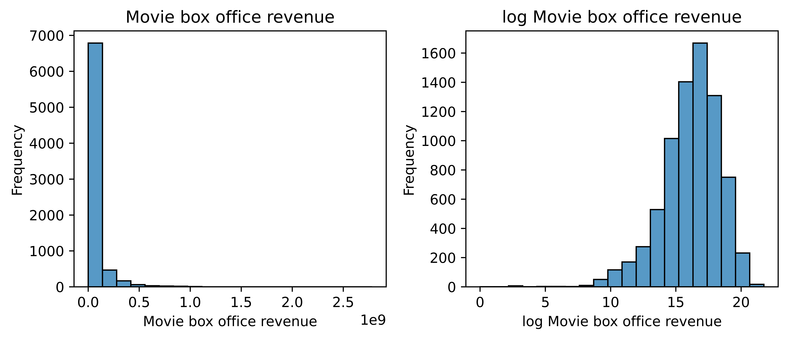

# Data cleaning

Taking a first look at the data set, we see that only around 10% of the movies have a box office revenue entry. Therefore we enrich the data set with TMDB data (<mark>kilde</mark>). The TMDB data gives us new attributes like revenue, original movie language and movie ranking, that might be interesting for out analysis. After enriching the data, <mark>hvor meget??</mark>% of the movies have a box office revenue entry.

Before diving into the data, it needs to be cleaned. Some of the movies have a runtime of 10 hours, or an actor with the height of 3 meters. All of these unrealistic attributes is removed, before continuing with the data.

## How has movie revenue developed over time?

Let's first take a look at out variable of intereset: **Movie box office revenue**. The left plot below shows, that very few movies have a very high revenue - and a lot of movie have a much lower revenue. This is called a **power law**, and to fix this, we log-transform this variable.

<mark>er det overhovedet relevant?</mark>

### Distribution
