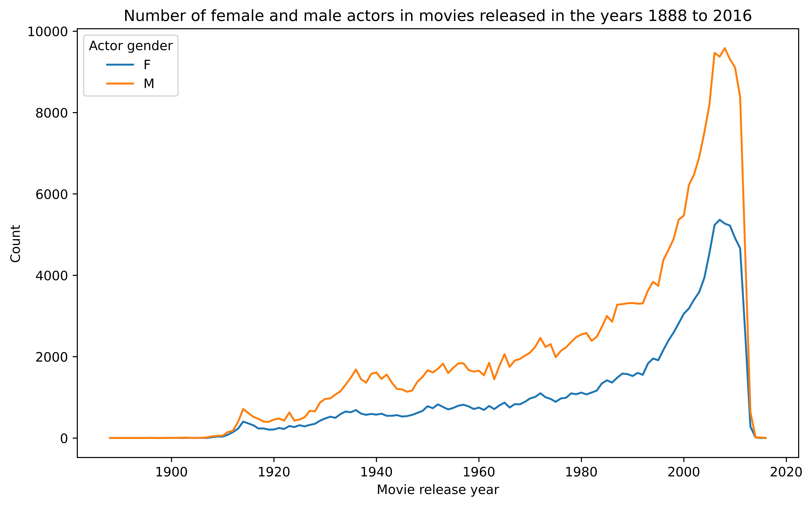
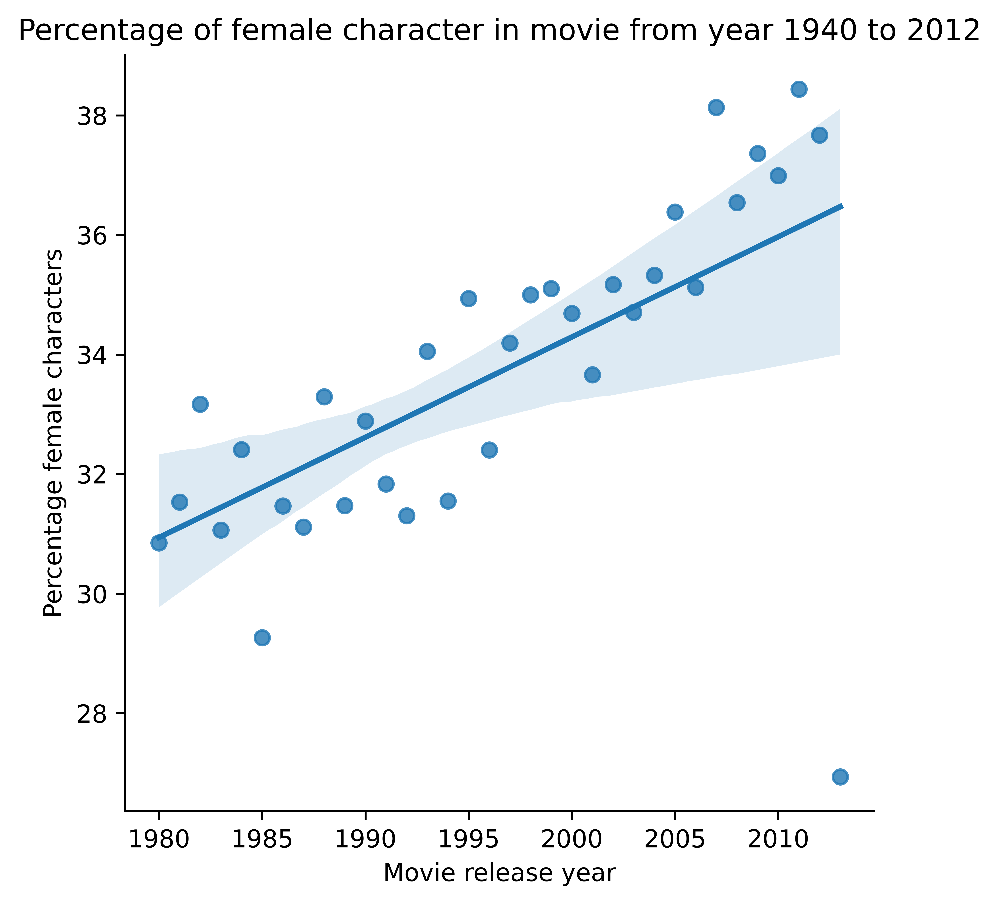
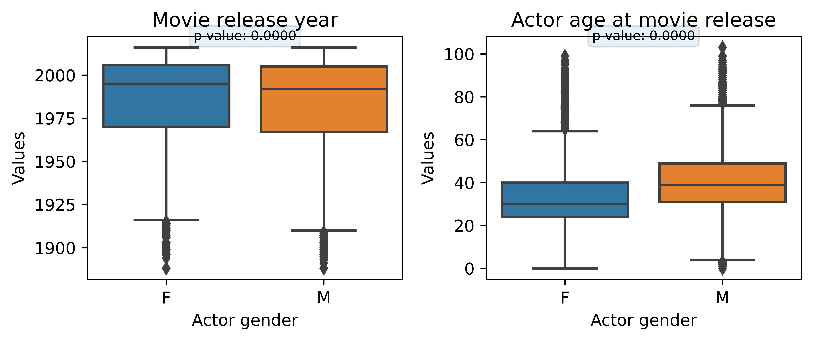
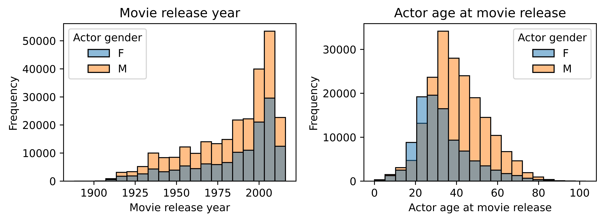

## How does gender representation influence movie revenue?

Let first take a look at the representation of male and female actors in movies over time.

There is a trend over all years, that there are more male actors than female actors in movies. But has there been not change in the last century?

Since there is only very few movies in the tails of the data set, we look at the progression of female characters from year 1940 to 2012.

As the plot shows, there is has been a significant increase in female actors in the past century. But does gender even effect the box office revenue of the movie? Let's dive into that.

This plot above shows, that there is a significant decrease in the box office revenue for a movie, if there are more female actors.

### Difference between male and female actors

We divide the character dataset into male and female character dataset, and use box plots and histograms to look at the distribution on the attributes. We also perform a t-test for each of the attributes with the nul-hypothesis: there is no difference between male and female.

The left plot show us, that there is a significant difference in release year of the movie, where female actors are more represented in recent years. We might want to log-transform these attributes, if they are used in further analysis.<mark>ikke relevant?</mark>

The right box plot shows us, that there is a significant difference in the age of male and female actors. It indicates, that female actors generally are younger than male actors in movies.

We also look at the distributions with a histogram: <mark>vælg én</mark>

<mark>log transform age?</mark>
